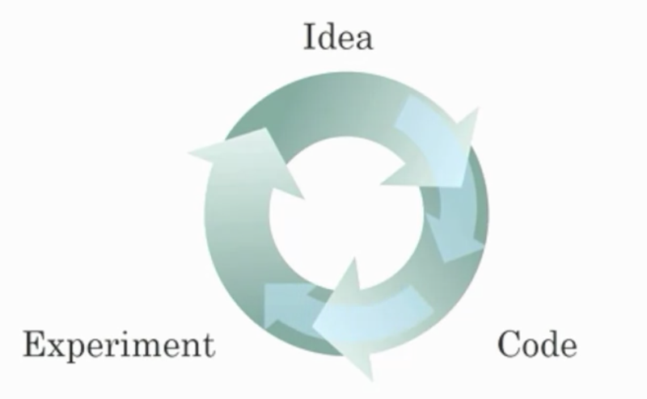

## Introduction to Deep Learning

1. What does the analogy “AI is the new electricity” refer to?
+ *AI runs on computers and is thus powered by electricity, but it is letting computers do things not possible before.*
+ **Similar to electricity starting about 100 years ago, AI is transforming multiple industries.**
+ *AI is powering personal devices in our homes and offices, similar to electricity.*
+ *Through the “smart grid”, AI is delivering a new wave of electricity.*

2. Which of these are reasons for Deep Learning recently taking off? (Check the three options that apply.)
+ **We have access to a lot more data.**
+ **Deep learning has resulted in significant improvements in important applications such as online advertising, speech recognition, and image recognition.**
+ **We have access to a lot more computational power.**
+ *Neural Networks are a brand new field.*

3. Recall this diagram of iterating over different ML ideas. Which of the statements below are true? (Check all that apply.)

+ (maybe) Recent progress in deep learning algorithms has allowed us to train good models faster (even without changing the CPU/GPU hardware).
+ (maybe) It is faster to train on a big dataset than a small dataset.
+ **Faster computation can help speed up how long a team takes to iterate to a good idea.**
+ **Being able to try out ideas quickly allows deep learning engineers to iterate more quickly.**
+ **Better algorithms can speed up the iterative process by reducing the necessary computation time.**
+ *Larger amounts of data allow researchers to try more ideas and then produce better algorithms in less time.*
+ *Better algorithms allow engineers to get more data and then produce better Deep Learning models.*
+ **Improvements in the GPU/CPU hardware enable the discovery of better Deep Learning algorithms.*

4. When building a neural network to predict housing price from features like size, the number of bedrooms, zip code, and wealth, it is necessary to come up with other features in between input and output like family size and school quality. True/False?
+ *True*
+ **False**

5. ReLU stands for which of the following?
+ *Recognition Linear Unit*
+ *Representation Linear Unit*
+ **Rectified Linear Unit**
+ *Rectified Last Unit*

6. Features of animals, such as weight, height, and color, are used for classification between cats, dogs, or others. This is an example of "structured" data, because they are represented as arrays in a computer. True/False?
+ **True**
+ *False*

7. A dataset is composed of age and weight data for several people. This dataset is an example of "structured" data because it is represented as an array in a computer. True/False?
+ **True**
+ *False*

8. Why can an RNN (Recurrent Neural Network) be used to create English captions to French movies? Choose all that apply
+ *The RNN requires a small number of examples.*
+ **The RNN is applicable since the input and output of the problem are sequences.**
+ *RNNs are much more powerful than a Convolutional neural Network (CNN).*
+ **It can be trained as a supervised learning problem.**

9. Suppose the information given in the diagram is accurate. We can deduce that when using large training sets, for a model to keep improving as the amount of data for training grows, the size of the neural network must grow. True/False?

+ **True**
+ *False*

10. Assuming the trends described in the figure are accurate. The performance of a NN depends only on the size of the NN. True/False?

+ *True*
+ **False**

11. Which of the following are reasons that didn't allow Deep Learning to be developed during the '80s?
+ **Limited computational power.**
+ **Interesting applications such as image recognition require large amounts of data that were not available.**
+ *People were afraid of a machine rebellion.*
+ *The theoretical tools didn’t exist during the 80’s.*

12. Neural networks are good at figuring out functions relating an input x to an output y given enough examples. True/False?
+ **True**
+ *False*
13. Which of the following depicts a activation function?

tanh activation function

14. Which of the following are examples of structured data? Choose all that apply.
+ **A dataset of weight, height, age, the sugar level in the blood, and arterial pressure.**
+ *A dataset with short poems.*
+ *A set of audio recordings of a person saying a single word.*
+ **A dataset with zip code, income, and name of a person.**

15. In this diagram which we hand-drew in the lecture, what do the horizontal axis (x-axis) and vertical axis (y-axis) represent?

+ - *x-axis is the performance of the algorithm*
  - *y-axis (vertical axis) is the amount of data.*
+ - **x-axis is the amount of data**
  - **y-axis (vertical axis) is the performance of the algorithm.**
+ - *x-axis is the amount of data*
  - *y-axis is the size of the model you train.*
+ - *x-axis is the input to the algorithm*
  - *y-axis is outputs.*

16. Assuming the trends described in the figure are accurate. Which of the following statements are true? Choose all that apply.

+ **Increasing the size of a neural network generally does not hurt an algorithm’s performance, and it may help significantly.**
+ maybe Increasing the training set size of a traditional learning algorithm stops helping to improve the performance after a certain size.
+ maybe Decreasing the training set size generally does not hurt an algorithm’s performance, and it may help significantly.
+ *Increasing the training set size of a traditional learning algorithm always improves its performance.*

